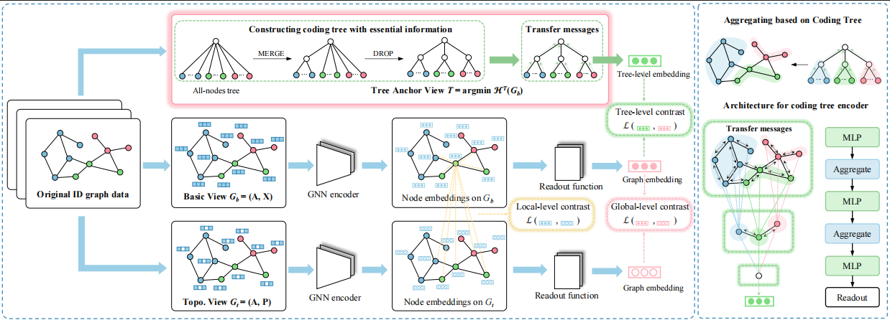

[](https://dl.acm.org/doi/abs/10.1145/3627673.3679779)


# [AAAI 2025] Structural Entropy Guided Unsupervised Graph Out-Of-Distribution Detection
This repository is the official implementation of "[Structural Entropy Guided Unsupervised Graph Out-Of-Distribution Detection](https://dl.acm.org/doi/abs/10.1145/3627673.3679779)" accepted by the 39th Annual AAAI Conference on Artificial Intelligence (AAAI 2025).

[](https://dl.acm.org/doi/abs/10.1145/3627673.3679779)

------

## 0. Abstract

With the emerging of huge amount of unlabeled data, unsupervised out-of-distribution (OOD) detection is vital for ensuring the reliability of graph neural networks (GNNs) by identifying OOD samples from in-distribution (ID) ones during testing, where encountering novel or unknown data is inevitable. Existing methods often suffer from compromised performance due to redundant information in graph structures, which impairs their ability to effectively differentiate between ID and OOD data. To address this challenge, we propose SEGO, an unsupervised framework that integrates structural entropy into OOD detection regarding graph classification. Specifically, within the architecture of contrastive learning, SEGO introduces an anchor view in the form of coding tree by minimizing structural entropy. The obtained coding tree effectively removes redundant information from graphs while preserving essential structural information, enabling the capture of distinct graph patterns between ID and OOD samples. Furthermore, we present a multi-grained contrastive learning scheme at local, global, and tree levels using triplet views, where coding trees with essential information serve as the anchor view. Extensive experiments on real-world datasets validate the effectiveness of SEGO, demonstrating superior performance over state-of-the-art baselines in OOD detection. Specifically, our method achieves the best performance on 9 out of 10 dataset pairs, with an average improvement of 3.7\% on OOD detection datasets, significantly surpassing the best competitor by 10.8\% on the FreeSolv/ToxCast dataset pair.


## 1. Requirements

Main package requirements:

- `CUDA == 11.1`
- `Python == 3.7.12`
- `PyTorch == 1.8.0`
- `PyTorch-Geometric == 2.0.0`

To install the complete requiring packages, use the following command at the root directory of the repository:

```setup
pip install -r requirements.txt
```


## 2. Quick Start
Just run the script corresponding to the experiment and dataset you want. For instance:

* Run out-of-distribution detection on all dataset pairs:
```bash
bash script/sego.sh
```

```bash
python treecl.py -exp_type oodd -DS_pair AIDS+DHFR -batch_size_test 128 -num_epoch 400 -num_cluster 10 -alpha 0.2
python treecl.py -exp_type oodd -DS_pair PTC_MR+MUTAG -num_epoch 400 -num_cluster 2 -alpha 0.8

```


## 3. Citation
If you find this repository helpful, please consider citing the following paper. We welcome any discussions with [hou_yue@buaa.edu.cn](mailto:hou_yue@buaa.edu.cn).

```bibtex
@inproceedings{
}
```
